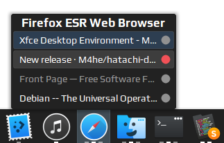

# hatachi-dockbarx-theme

A simple DockBarX main and popup theme designed for dark panels.

## Installation

Simple grab the latest version from the releases page and drop the extracted structure (don't extract the `Hitachi.tar.gz` files though!) into your `~/.dockbarx/themes/` folder. Alternatively you may use the manual build process as instructed below.

## Build Instructions

- use `build.sh` to rebuild from the `src/` folder
    - built files will be put/updated in the `dist/` folder

- use `install.sh` to install the built theme into your home directory
    - the files will be put into `~/.dockbarx/themes/` and `~/.dockbarx/themes/popup_styles/`